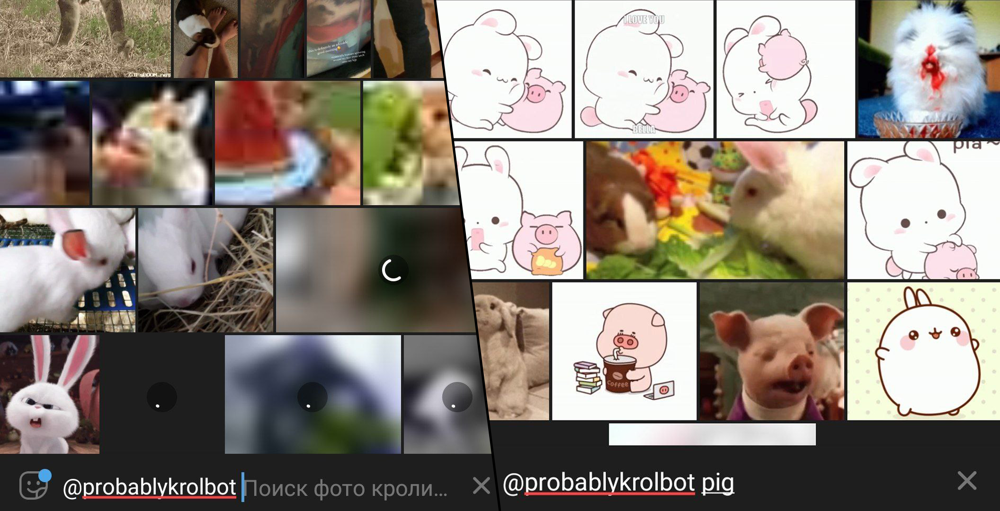

# Probablykrol bot

Пробабли — кролик. А это — бот, который ищет картинки Probably в сети. 

Телеграм бот, ищущий в Tenor, Imgur, Instagram анимированные гифки по заданному запросу в боте + запросу от пользователя.



Если вам интересно, зачем создавался этот бот, то в основном для троллинга одного модератора чата Telegram в марте 2021 года. Вы можете изменить целевую фразу с текущей ("bunny", "rabbit") на любую другую.

## Начало работы

1. Скачайте репозиторий
2. Запустите `composer update` для установки зависимостей проекта, скачать composer можно [здесь](https://getcomposer.org/download/)
3. Отредактируйте код бота в соответствии с вашими нуждами
   - Строка 113: замените `bunny%20rabbit%20` на любые целевые слова, после каждого проставляя символ `%20`. Например, если вы хотите увидеть свинок, замените на `pig%20`, а если кошек то `cat%20kitty%20pussy%20`
   ```php
   $constURL = "https://api.imgur.com/3/gallery/search/time/all/0?q_all=bunny%20rabbit%20".urlencode($queryText)."&q_type=anigif";
   ```
   - Строка 129: то же самое
   ```php
   $constURL = "https://g.tenor.com/v1/search?q=rabbit%20".urlencode($queryText)."&limit=50&key=".$key;
   ```
   - Строки 157-168: Получение из Instagram отключено, потому что вызывало баги. Вы можете самостоятельно включить эту секцию, если разбираетесь в PHP
   - Строка 173: это сообщение увидит пользователь, если напишет в личные сообщения боту. Замените текст внутри кавычек. Избегайте использования символа одинарная кавычка внутри текста, потому что это вызовет ошибку в программе. Можно использовать синтаксис Markdown для Telegram.
   ```php
   $message = 'Нажмите на кнопку ниже и выберете чат. Пробаблу кролик 🐰';
   ```
4. Для работы бота не требуется веб-сервер, однако он работает на веб-хуках телеграм и ожидает входные данные от сервера телеграм в php://input. Вы также можете настроить серверную функцию.
5. Для работы бота понадобится создать аккаунт в BotFather. Ключи вставьте в файл .env согласно шаблону в файле .env.example после знака равно
6. Также создайте API клиенты [Imgur](https://api.imgur.com/oauth2/addclient) и [Tenor](https://tenor.com/developer/dashboard). Ключи вставьте по шаблону в файл .env
7. Бот готов к работе: укажите путь к исполняемому php файлу как к вебхуку с помощью метода setWebhook в Telegram Bot API.

## Пример .env файла

```php
TELEGRAM_BOT_API_TOKEN=5348991594:AAHj_h81Z9rtPyEnpYisknis2-ZTpVy-SYY
IMGUR_CLIENT_ID=Qa66Q64YNHwqBki
TENOR_API_KEY=NVVL5ONA552I
```

## Проекты, использующие бота

Откройте [PR](https://github.com/VityaSchel/probablykrol-bot/fork), чтобы добавить сюда вашего бота

- [ProbablyKrolBot](https://t.me/probablykrolbot) — Кролик Пробабли, модератор сервера Саши Citinez
- [Piginez bot](https://t.me/piginezbot) — Свинтуз Александр Семакин (затуп)

## Лицензия

MIT

## Спонсирование

[hloth.dev/donate](https://hloth.dev/donate)